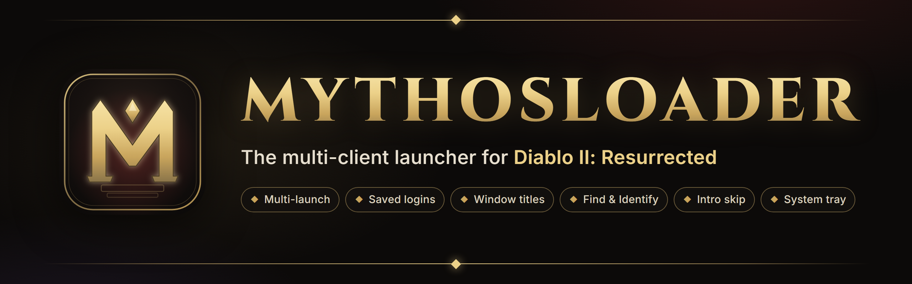
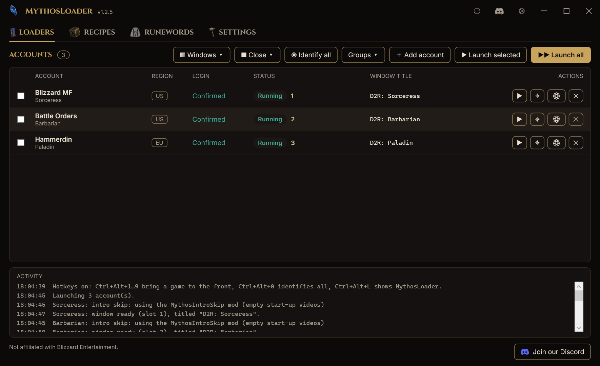
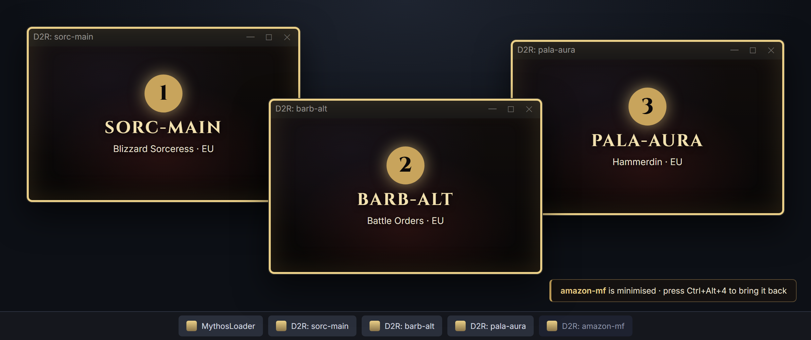
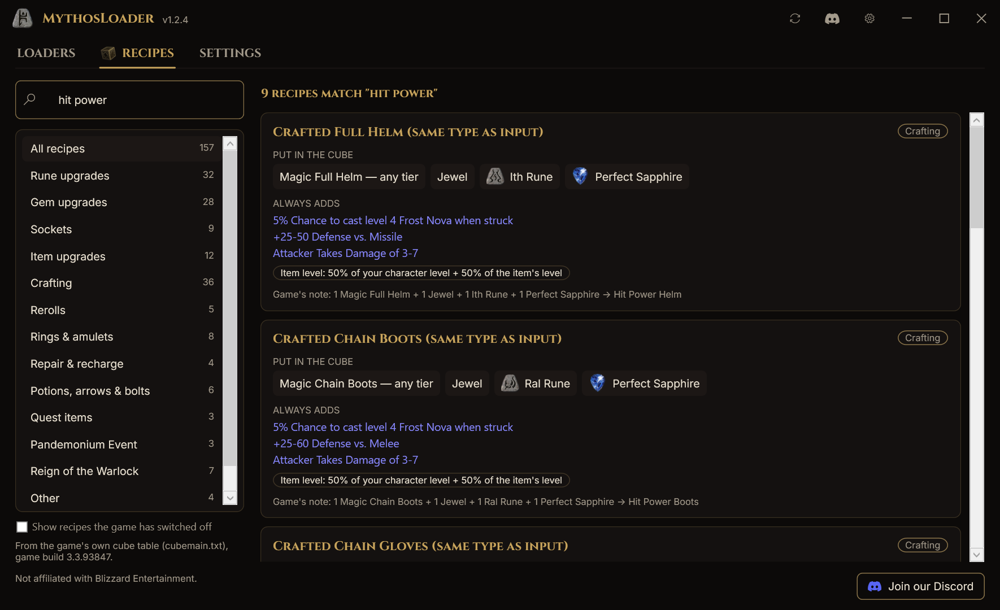
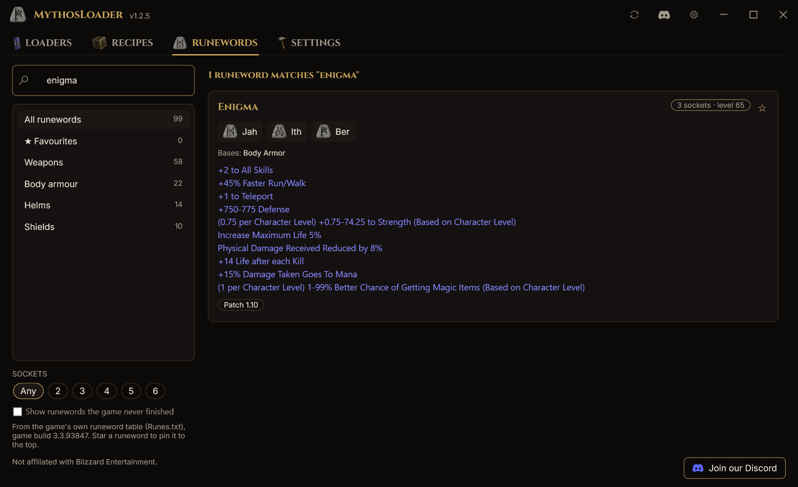
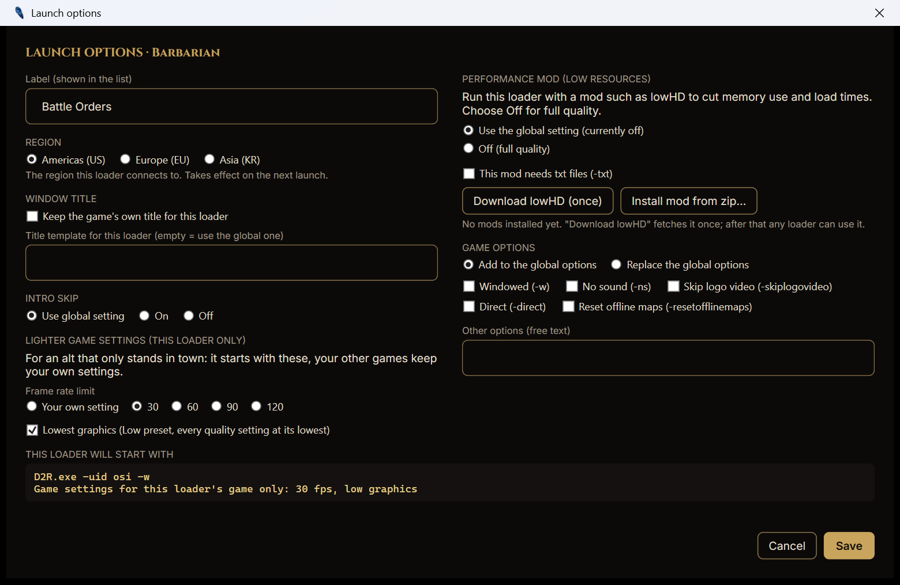
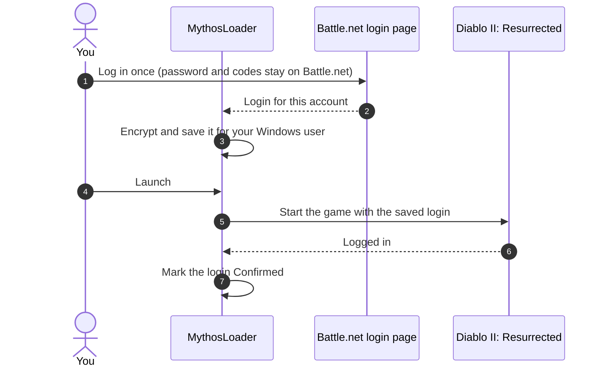
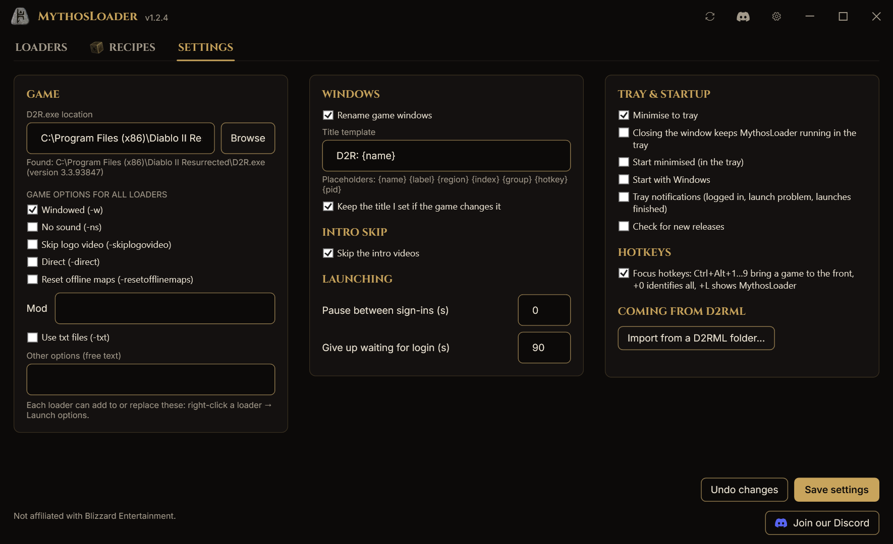

<p align="center">
  
</p>

<p align="center">
  <a href="https://discord.com/invite/d2rmythos"></a>
  
  
  
</p>

<p align="center">
  <b>
    <a href="#-features">Features</a> ·
    <a href="#-how-it-works">How it works</a> ·
    <a href="#-security-and-privacy">Security</a> ·
    <a href="#-getting-started">Getting started</a> ·
    <a href="#-faq">FAQ</a> ·
    <a href="https://d2r.org/loader">Website</a> ·
    <a href="https://discord.com/invite/d2rmythos">Discord</a>
  </b>
</p>

---

> [!IMPORTANT]
> **MythosLoader 1.2.5 is out.** [Download it from the Releases page](../../releases/latest).
> New in 1.2.5: **window layouts** (tile your games, they reopen where you left them), **Close all** and
> **Relaunch closed** after a crash, **lighter game settings for alts**, a **Runewords** tab and
> **favourite** recipes and runewords. If you already have 1.1 or newer, press **Update** in the title bar.
>
> Sections marked **(planned)** describe features coming in later releases. MythosLoader is not
> code-signed yet. If something doesn't work for you, tell us on
> [Discord](https://discord.com/invite/d2rmythos).

**MythosLoader** lets you play several Diablo II: Resurrected accounts on one PC at the same time.
Add each Battle.net account once, then launch one, a few, or all of them with a single click. Every
game window gets its own name, so you always know which client is your Sorceress and which is your
Barbarian, and a press of a button tells you exactly where each one is on your screens.

No more logging in by hand. No more alt-tabbing through four identical windows called
"Diablo II: Resurrected". No command windows flashing, no extra tools to download.

<p align="center">
  
  <br>
  <sub><i>The Loaders tab with three demo loaders running.</i></sub>
</p>

## 📜 Contents

- [Why MythosLoader](#-why-mythosloader)
- [Features](#-features)
  - [Accounts and saved logins](#accounts-and-saved-logins)
  - [Run several clients side by side](#run-several-clients-side-by-side)
  - [Close, crash recovery and relaunch](#close-crash-recovery-and-relaunch)
  - [Window titles](#window-titles)
  - [Find and Identify](#find-and-identify)
  - [Focus hotkeys](#focus-hotkeys)
  - [Intro skip](#intro-skip)
  - [Cube recipes](#cube-recipes)
  - [Runewords](#runewords)
  - [System tray](#system-tray)
  - [Game options](#game-options)
  - [Performance mod (lowHD)](#performance-mod-lowhd)
  - [Lighter game settings for alts](#lighter-game-settings-for-alts)
  - [Updates](#updates)
  - [Groups and launch order](#groups-and-launch-order)
  - [Shortcuts and command line](#shortcuts-and-command-line)
  - [Window layouts](#window-layouts)
  - [Portable mode](#portable-mode)
- [Coming from D2RML?](#-coming-from-d2rml)
- [How it works](#-how-it-works)
- [Security and privacy](#-security-and-privacy)
- [Requirements](#-requirements)
- [Getting started](#-getting-started)
- [Settings reference](#-settings-reference)
- [FAQ](#-faq)
- [Troubleshooting](#-troubleshooting)
- [Roadmap](#-roadmap)
- [Community and support](#-community-and-support)
- [Disclaimer](#-disclaimer)

## ⚔ Why MythosLoader

Diablo II: Resurrected is built to run one copy at a time, and every launch normally means going
through Battle.net. If you play with more than one account (a magic-find character, a Battle Orders
barbarian, a mule, a friend's rush) that gets old fast:

| The usual way | With MythosLoader |
|---|---|
| The game refuses to open a second copy | Open as many clients as your PC can handle |
| Log in through Battle.net for every account, every time | Log in once per account; after that it's one click |
| Four windows all called "Diablo II: Resurrected" | `D2R: sorc-main`, `D2R: barb-alt`, `D2R: pala-aura`… named your way |
| Hunting through the taskbar for the right client | **Find** brings it to the front, **Identify** labels every window on screen |
| Sitting through the intro videos on every client | Skipped automatically, per account if you like |
| Typing launch options into shortcuts | Checkboxes for common options, globally or per account |

## ✨ Features

| | |
|---|---|
| 🔑 **Saved logins** | Log in on Battle.net's own page once. MythosLoader never sees your password. |
| 🪟 **Multi-launch** | One account, a group, or everything: all games load at once, then sign in a second or two apart. |
| ▦ **Window layouts** | Tile your games on one monitor or across all of them; each opens where you left it next time. |
| ↻ **Close and relaunch** | Close all or some games in one go; after a crash, **Relaunch closed** starts them again. |
| 🏷 **Window titles** | Name every game window with a template like `D2R: {name}` or `[{index}] {label}`. |
| 🎯 **Find** | Bring any client to the front, even when it's minimised or on another monitor. |
| 🔦 **Identify** | Flash a big gold label over every running client so you can see which is which. |
| ⌨ **Focus hotkeys** | `Ctrl+Alt+1` to `9` jump straight to a client. |
| ⏩ **Intro skip** | No more logo videos and no "Press any key": straight to signing in. |
| 🧊 **Cube recipes** | Every Horadric Cube recipe in the game, searchable, with rune and gem pictures. |
| 📜 **Runewords** | Every runeword with its runes in order, bases, sockets, level and stats. Star your favourites. |
| 🧭 **System tray** | Launch, focus and identify clients from the tray menu. |
| ⚙ **Game options** | Windowed, no sound, mods and more, for all accounts or per account. |
| 🪶 **Performance mod** | Run chosen loaders with lowHD to cut memory use and load times. One-click download. |
| 🐢 **Lighter settings for alts** | A frame rate limit and the lowest graphics for one loader only; your main keeps its settings. |
| ⬆ **Built-in updates** | A new version is one click away; no trip to GitHub. |
| 🗂 **Groups** | "MF team", "Rush", "Mules": launch a whole group in one go. |
| 🔗 **Shortcuts** | Desktop shortcuts and command-line launching for any account or group. |
| 🔒 **Encrypted storage** | Saved logins are encrypted for your Windows user account. |

### Accounts and saved logins

- **Add an account** by logging in on Battle.net's real login page, shown inside MythosLoader.
  Authenticator and e-mail codes work exactly like they do in your browser.
- Prefer your own browser? Log in there and paste the address from the address bar instead.
- MythosLoader keeps the login, **not your password**, and encrypts it for your Windows user.
- **Log in once.** The login is saved the moment you add it and is used for every launch. If the
  game ever hands back a newer one, MythosLoader saves that automatically.
- Every account shows its **region**, its **login** (*Saved* until a launch has logged in with it,
  then *Confirmed*, and it stays confirmed) and its **status** (Running, Closed, …).
- If a login stops working, right-click the loader and choose **Log in again**.

### Run several clients side by side

Diablo II: Resurrected normally refuses to start a second copy. MythosLoader takes care of that by
itself on every launch. There's nothing extra to download and no command windows popping up.

- Launch **one account**, **the ones you ticked**, **a group**, or **all of them**.
- **All games load at the same time.** Then they sign in one by one, in whatever order they reach the
  title screen, each as soon as the one before it has picked up its login (about a second each). Two
  accounts are usually in the game in around ten seconds.
- Each game only ever signs in with its own account: the next account's login is handed over only after
  the previous game has taken its own.
- A progress strip shows what's happening (`Launching barb-alt (2 of 3) · waiting for login`) with
  **Cancel** and **Cancel all** buttons.
- Clicking launch on an account that's already running brings it to the front instead of starting a
  second client on the same account. **Launch all** skips loaders that are already running, also after
  MythosLoader was closed and opened again.
- *(planned)* Games started some other way are listed under **Other clients**, and you can tell
  MythosLoader which account they belong to.

### Close, crash recovery and relaunch

- **■ Close ▾** closes **all games** or **the ones you ticked** in one go, after a Yes/No check.
  Right-click a loader → **Close game** closes just that one. Each game is asked to close, exactly like
  pressing its X, so it shuts down normally.
- If a game closes by itself with an error, its row says **Crashed (exit code …)**, the Activity panel
  says so and (with notifications on) a tray notification tells you.
- **↻ Relaunch closed** appears whenever games have closed since you launched them, crashed or not, and
  starts them all again with one click.

### Window titles

Every game window can be renamed so it's easy to find in the taskbar, in Alt+Tab and on screen.

- One **global template** for all accounts, plus a **per-account override**.
- **Live rename:** change the template and every running window updates instantly.
- **Title keeper:** if the game resets its title, MythosLoader puts yours back within a second.
- **Keep the game's title** per account, for overlays or tools that look for the original title.

| Placeholder | Becomes | Example |
|---|---|---|
| `{name}` | Account name | `sorc-main` |
| `{label}` | Your label for the account (falls back to the name) | `Blizzard Sorceress` |
| `{region}` | Region | `EU` |
| `{index}` | Slot number of the running client | `2` |
| `{group}` | Group it was launched with | `MF team` |
| `{hotkey}` | Its focus hotkey | `Ctrl+Alt+2` |
| `{pid}` | Windows process number | `14200` |

Ready-made presets:

```text
D2R: {name}                 →  D2R: sorc-main
[{index}] {label}           →  [1] Blizzard Sorceress
{label} · {region}          →  Blizzard Sorceress · EU
D2R {index} - {name} ({hotkey})  →  D2R 1 - sorc-main (Ctrl+Alt+1)
```

### Find and Identify

<p align="center">
  
  <br>
  <sub><i>Concept of Identify all: every client is labelled for a few seconds.</i></sub>
</p>

- **Find** (row button, double-click, tray menu or hotkey) restores the client if it's minimised,
  brings it to the front and flashes it.
- **Identify** draws a gold border with the slot number and account name over a client for three
  seconds. **Identify all** does it for every running client at once. Minimised clients are listed
  in a small notification instead.
- The label is drawn *over* the game window by MythosLoader itself; nothing is added to the game.

### Focus hotkeys

Off by default; turn them on in Settings.

| Hotkey | Action |
|---|---|
| `Ctrl+Alt+1` … `Ctrl+Alt+9` | Bring client 1 to 9 to the front |
| `Ctrl+Alt+0` | Identify all |
| `Ctrl+Alt+L` | Show MythosLoader |

- A game gets the lowest free number when it starts; the number is shown next to its status and can be
  put in its window title with `{index}` or `{hotkey}`.
- Bare F-keys are never used: F1 to F8 are your skill keys in game.
- If another program already owns one of the hotkeys, MythosLoader says so in the Activity panel and
  skips that one.
- A hotkey only ever brings one window to the front. Nothing is sent to the games.

### Intro skip

- On by default, with a per-account override (Inherit / On / Off).
- MythosLoader adds a tiny mod, `MythosIntroSkip`, to the game's `mods` folder. It only replaces the two
  start-up videos with empty files, so the game goes straight to the title screen. Your saves, settings
  and key bindings stay where they are.
- "Press any key to begin" is pressed for you, on that client only and only on its turn to sign in. No key
  reaches a game after it has signed in, so nothing can land on the character screen.
- A loader that already uses lowHD needs nothing extra (lowHD skips the videos the same way). With another
  mod (the game takes only one) the videos play, and the title key still comes on its turn.

### Cube recipes

The **Recipes** tab lists every Horadric Cube recipe in the game: rune and gem upgrades, sockets, item
upgrades, crafting with its fixed mods, rerolls, rings and amulets, repairs, quest items, the Pandemonium
Event and Reign of the Warlock.

- Search by anything: a rune (`ber`), a gem, an item, a mod (`frost nova`), or a recipe name (`hit power`).
- Pick a category to narrow the list; the counts show how many recipes each has.
- Every card shows what goes in the cube (with pictures and counts), what comes out, the mods a crafted
  item always gets, its item level rule, and notes such as **Ladder only** or **Nightmare and Hell only**.
- Press the ☆ on a recipe to make it a **favourite**: favourites are listed first and have their own
  **★ Favourites** group.
- The recipes are read from the game's own cube table and built into MythosLoader, so the tab works
  offline.

<p align="center">
  
</p>

### Runewords

The **Runewords** tab lists every runeword in the game (99, plus the ones the game never finished if you
want to see them).

- Each card shows the runes **in socket order** with their pictures, the number of sockets, the level
  needed, the item types it can go in, and its stats (separately for weapons and shields where they
  differ). It also says where it came from: Patch 1.10, D2R Ladder seasons and so on.
- Search by name, rune (`jah`), base (`shield`) or stat (`teleport`); narrow it down by item type and
  number of sockets.
- Star runewords to keep them in your **★ Favourites**.
- Read from the game's own runeword table and built into MythosLoader, so it works offline.

<p align="center">
  
</p>

### System tray

| Setting | Default |
|---|---|
| Minimise to tray | On |
| Close to tray | Off |
| Start minimised | Off |
| Start with Windows | Off |
| Notifications (login finished, login failed, all launches done) | On |

```text
MythosLoader
├─ Launch ▸           sorc-main · barb-alt · pala-aura · Launch all
├─ Launch group ▸     MF team · Mules
├─ Running ▸          [1] sorc-main · [2] barb-alt        (click to bring to front)
├─ Identify all
├─ Cancel launches    (while launching)
├─ Show MythosLoader
├─ Discord community
├─ Settings
└─ Exit               (your games keep running)
```

Left-click the tray icon to show or hide MythosLoader. Exiting MythosLoader never closes your games.

### Game options

Set launch options for all accounts in Settings, then add to them or replace them per account:
right-click a loader and choose **Launch options**. The same menu switches a loader's region
(Americas / Europe / Asia) without re-adding it, and replaces its login with a new token.

| Option | What it does |
|---|---|
| Windowed | Starts the game in a window |
| No sound | Mutes the client (great for second accounts) |
| Skip logo video | Passes the game's `-skiplogovideo` switch (no effect on current game builds; use Intro skip) |
| Mod `<name>` | Loads a mod, with an optional *use txt files* switch |
| Direct | For extracted game data |
| Reset offline maps | Fresh offline maps on every game |
| Free text | Anything else, with normal Windows quoting |

A live preview shows exactly what each account will launch with. Options that would put login details
on the command line are blocked.

### Performance mod (lowHD)

Running several clients is heavy. A loader can run with **lowHD**, a mod by **celloboy126** that blocks
most game content to greatly reduce memory use and load times, while your other loaders stay at full
quality.

- In a loader's **Launch options**, press **Download lowHD (once)**. MythosLoader downloads the mod
  (about 14 MB), checks it, and installs it into your game's `mods` folder. You only do this once.
- After that, switch it per loader: right-click a loader → **Performance mod** → `lowHDfiller`,
  **Off (full quality)**, or **Use global setting**.
- A loader with its own choice shows a small `mod: lowHDfiller` or `full quality` tag in the list.
- The mod's recommended low-graphics settings are added for the mod only, so loaders without the mod
  keep your normal graphics settings. Existing settings are never overwritten.
- Other mods work too: **Install mod from zip…** installs any mod you downloaded yourself.

lowHD is not made by us. All credit goes to its author; the original page is on
[Nexus Mods](https://www.nexusmods.com/diablo2resurrected/mods/1054). If your game is installed under
`Program Files`, Windows may ask you to run MythosLoader as administrator once for the install.

### Lighter game settings for alts

An alt that only stands in town (a Battle Orders barbarian, a mule, an aura paladin) doesn't need full
graphics. In a loader's **Launch options**, under **Lighter game settings (this loader only)**:

- **Frame rate limit**: your own setting, 30, 60, 90 or 120 fps.
- **Lowest graphics**: the Low preset with every quality setting at its lowest.

That loader's game starts with these; all your other games keep your own settings. All copies of the game
share one settings file, so MythosLoader writes the lighter values just before that game starts and puts
your file back as soon as the game has read it (a couple of seconds), before the next game starts. If you
quit the alt from its menu (which saves its settings), the lighter values are set back to yours when it
closes. If anything is interrupted, MythosLoader repairs it the next time it starts.

<p align="center">
  
</p>

### Updates

- MythosLoader checks for a new release when it starts. When there is one, an **⬇ Update** button
  appears in the title bar.
- One click downloads the new version, verifies it against the release's checksum, replaces the
  program and restarts it. Your running games are not closed.
- The **Check for updates** button next to Settings checks on demand. The automatic check can be
  turned off in Settings.

### Groups and launch order

- Create named groups such as **MF team**, **Rush** or **Mules**; a loader can be in several.
- Right-click a loader → **Groups** to add it to a group or make a new one.
- Launch a group from the **Groups** button, the tray menu or the command line. Its loaders start in
  the order they were added.
- `{group}` in a title template shows the loader's group.

### Shortcuts and command line

```powershell
MythosLoader.exe --launch sorc-main barb-alt   # launch these accounts, in this order
MythosLoader.exe --group "MF team"             # launch a group
MythosLoader.exe --minimized                   # start in the tray
```

- These work when MythosLoader is not already running.
- *(planned)* forwarding to an already-open MythosLoader, and **Create desktop shortcut**.

### Window layouts

- **▦ Windows ▾ → Tile on this monitor** arranges all running games in a grid on the monitor MythosLoader
  is on, as big as they fit at the game's 16:9 shape (two side by side, four in a 2×2, …).
- **Tile across all monitors** spreads them evenly over every monitor.
- Each game **opens where it was** next time: positions are saved when you tile, with **Save window
  positions**, and when you close a game from MythosLoader. **Forget saved positions** clears them.
- A saved place on a monitor that is no longer there is ignored, and full-screen games are left alone.
- Turn it off in Settings ("Remember each game's window position").

### Portable mode

Put an empty file named `portable` next to `MythosLoader.exe` and all settings stay in a `data`
folder beside it, handy for a USB stick or a games drive. Saved logins are still tied to your Windows
user, so on another PC or user you simply log in again.

## 🔁 Coming from D2RML?

MythosLoader is a modern successor to Sunblood's **D2RML**, which pioneered one-click multi-launching
for D2R and stopped working after patch 2.5. Thanks to Sunblood for the original idea.

| | D2RML | MythosLoader |
|---|---|---|
| Works on current D2R | ❌ Stopped at patch 2.5 | ✅ Built for the current game |
| Extra tools | Needs `handle64.exe` | Nothing extra |
| Administrator rights | Always | Designed to run as a normal user |
| Saved logins | Plain files next to the program | Encrypted for your Windows user |
| Window titles | Fixed `D2R:name` | Templates, per-loader override, live rename, title keeper |
| Find / Identify / hotkeys | ❌ | ✅ |
| Intro skip | Space pressed for 15 s into whichever game window it finds first | Empty-video mod, and the title key on that client's turn only; per account |
| Tray menu | Empty | Launch, launch group, focus, identify, settings |
| Game options | One global text box | Global + per account, with checkboxes and a live preview |
| Groups | ❌ | ✅ |
| Timeouts and Cancel | ❌ Can wait forever | ✅ Every step has a timeout and a Cancel button |

**Import from D2RML** (Settings → Coming from D2RML) brings over your loaders and settings in one step.
It works for `.bin` files saved by the same Windows user on the same PC that still hold a login; the
rest are listed as skipped. Your old files are left untouched.

## 🧠 How it works



1. **Log in once.** You log in on Battle.net's own page. MythosLoader only receives the result of
   that login, never your password.
2. **Saved, encrypted.** The login is stored encrypted for your Windows user account.
3. **Launch.** MythosLoader starts all your games at once, skips the intro, and signs them in one by
   one, handing each game its own saved login. It names every window as it opens.
4. **Confirmed.** Once a launch has logged in, the loader's login shows **Confirmed** and is used
   again on every launch. If the game hands back a newer login, MythosLoader saves it for you.

> [!TIP]
> If a loader stops connecting (for example after that account was used somewhere else), right-click
> it and choose **Log in again**.

## 🔒 Security and privacy

**What MythosLoader stores** (in `%LocalAppData%\MythosLoader`, or next to the program in portable mode):

| File | Contents | Encrypted |
|---|---|---|
| `settings.json` | Your preferences | No secrets in it |
| `accounts.json` | Account names, labels, groups, per-account options, saved logins | Saved logins: **yes**, with Windows DPAPI |

**What it never does**

- Never asks for, sees or stores your Battle.net password.
- Never reads or changes the game's memory, never injects anything into the game, never automates
  gameplay.
- Never sends one keystroke or click to several clients. Blizzard bans input broadcasting, and
  MythosLoader has no such feature.
- Never sends your data anywhere. The only network traffic is Battle.net's own login page and a
  a check of this repository for new releases when MythosLoader starts (you can turn it off), and the
  lowHD download if you ask for it.

**An honest note on encryption.** Your saved logins are encrypted for your Windows user, which
protects them from other Windows users on the PC and from anyone who copies the files. Like any
program, it can't protect them from other software running under *your own* Windows account, so keep
your PC clean.

**What it touches on your PC**

| Area | What and why |
|---|---|
| Game process | Closes the game's "already running" check so another copy can start. Asks Windows only for the rights needed for that. |
| Game windows | Reads their position, sets their title, brings them to the front. Presses Space on a game's title screen during its turn to sign in, never after. |
| Registry | Writes the game's login slot right before a launch. Optional: the *Start with Windows* entry. |
| Files | Its own data folder. With intro skip on: a small `MythosIntroSkip` folder in the game's `mods` folder. If you install a mod: the game's `mods` folder, and that mod's own settings folder under Saved Games. |
| Network | Battle.net login page; update check and downloads from this project's GitHub releases. |

## 💻 Requirements

- Windows 10 (version 1809 or newer) or Windows 11, 64-bit
- Diablo II: Resurrected installed through Battle.net
- Microsoft Edge WebView2 (already part of Windows 11 and up-to-date Windows 10) for the built-in login page
- A Battle.net account per client you want to run, each owning the game
- Enough PC for several clients: every client is a full copy of the game

## 🚀 Getting started

1. **Download** `MythosLoader-1.2.5-win-x64.zip` from the [Releases](../../releases/latest) page.
2. **Unblock** it: right-click the zip → **Properties** → tick **Unblock** → **OK**. This stops the
   "Windows protected your PC" warning.
3. **Unzip** it anywhere you like. There's no installer.
4. **Run** `MythosLoader.exe`. It finds your game folder automatically (or set it in Settings).
5. **Add your accounts.** Click **＋ Add account**, then paste a login token (`US-…`, `EU-…`, `KR-…`) or log in on the Battle.net page.
6. **Launch.** Tick your accounts and press **Launch selected**, or just **Launch all**.

**Verify your download** (optional): every release lists SHA-256 checksums in `SHA256SUMS.txt`.

```powershell
Get-FileHash .\MythosLoader-1.2.5-win-x64.zip -Algorithm SHA256
```

**Windows warnings.** MythosLoader is not code-signed yet, so Windows may warn about it:

- **Your browser holds back the download:** Edge: **…** → **Keep** → **Keep anyway**. Chrome: **Ctrl+J** → **Keep**.
- **"Windows protected your PC":** click **More info** → **Run anyway** (or unblock the zip first, step 2).
- **"Smart App Control blocked an app":** there is no "Run anyway" for this one. The only way past it is turning
  Smart App Control off (Windows Security → App & browser control); Windows usually does not let you turn it back
  on without resetting the PC, so think before you do. Ask on Discord if unsure.
- **Antivirus removed the file:** check the checksum, then restore it and report the false positive.

## 🛠 Settings reference

<p align="center">
  
</p>

| Section | Setting | Default |
|---|---|---|
| Game | Game folder | Detected automatically |
| Game | Launch options for all accounts | None |
| Windows | Rename game windows | On |
| Windows | Title template | `D2R: {name}` |
| Windows | Title keeper | On |
| Windows | Remember each game's window position | On |
| Windows | Focus hotkeys | Off (`Ctrl+Alt`) |
| Intro skip | Skip intro videos | On |
| Intro skip | Method | Empty-video mod |
| Launching | Pause between sign-ins | 0 seconds |
| Launching | Give up waiting for login after | 90 seconds |
| Launching | Restore the game's login slot afterwards | On |
| Tray & startup | Minimise / close to tray, start minimised, start with Windows | On / Off / Off / Off |
| Tray & startup | Notifications | On |
| Updates | Check for new releases | On (once a day) |
| Advanced | Connection indicator per client | On |

Per account: label, title template or *keep the game's title*, hotkey slot, intro skip, launch
options (add or replace), performance mod, lighter game settings (frame rate limit, lowest graphics), saved
window position, groups.

## ❓ FAQ

<details>
<summary><b>Is this allowed by Blizzard?</b></summary>

Blizzard allows playing several accounts at the same time. What it bans is input broadcasting:
software or hardware that sends one keystroke or click to several game clients. MythosLoader has no
such feature and never will. It is still a third-party tool, so use it at your own risk.
</details>

<details>
<summary><b>Does MythosLoader see my password?</b></summary>

No. You log in on Battle.net's real login page. MythosLoader only receives the login result that
page produces, the same thing the Battle.net app receives.
</details>

<details>
<summary><b>How many clients can I run?</b></summary>

As many as your PC can handle and you have accounts for. Each client is a full copy of the game, so
memory and graphics power are the limit. Windowed mode and *No sound* help on second clients.
</details>

<details>
<summary><b>Why does an account say "Log in again"?</b></summary>

Its saved login was used up, usually because the account was played through the normal Battle.net
app in the meantime, or because it wasn't launched for a long time. Click **Log in again** and it's
fixed.
</details>

<details>
<summary><b>Can I still use the Battle.net app?</b></summary>

Yes. Just remember that logging into an account there uses up the login MythosLoader saved for it.
MythosLoader warns you when Battle.net is running during a launch.
</details>

<details>
<summary><b>My map tool or overlay can't find the game since the windows were renamed.</b></summary>

Turn on **Keep the game's title** for that account (account settings → Window). Some tools look for
the original "Diablo II: Resurrected" title.
</details>

<details>
<summary><b>Can I move MythosLoader to another PC?</b></summary>

Your settings, groups and options move fine (portable mode makes it easy). Saved logins are encrypted
for your Windows user on that PC, so on a new PC you log each account in once more.
</details>

<details>
<summary><b>Is it open source?</b></summary>

No. MythosLoader is free to use, but its source code is private. This repository holds the releases,
documentation and issue tracker.
</details>

<details>
<summary><b>Windows says "Windows protected your PC" or "Smart App Control blocked an app".</b></summary>

MythosLoader is not code-signed yet, so Windows does not recognise it. For **"Windows protected your PC"**
click **More info** → **Run anyway**, or right-click the zip → **Properties** → **Unblock** before extracting so the
warning never appears. **Smart App Control** has no "Run anyway": the only way past it is turning it off (Windows Security → App &
browser control), which Windows usually does not let you undo without resetting the PC. Updates through the
**Update** button never show these warnings.
</details>

<details>
<summary><b>My antivirus complains.</b></summary>

Multi-launchers have to close the game's "already running" check inside the game process, which some
antivirus products find suspicious. Releases come with SHA-256 checksums. Check the file against `SHA256SUMS.txt`, restore it
from your antivirus (Defender: Protection history → Restore), and report the false positive to your antivirus
vendor. Tell us on Discord too, so we can report it as well.
</details>

## 🩹 Troubleshooting

| Problem | What to try |
|---|---|
| "Game not found" | Settings → Game → pick the folder that contains `D2R.exe` |
| Login timed out | The saved login was used up: **Log in again** on that account |
| The game closed before logging in | Launch again; if it repeats, check the game runs normally through Battle.net |
| Second client won't start | Make sure every running client was started normally; restart MythosLoader and try again |
| Window title not applied | Check *Rename game windows* in Settings and the loader's Launch options |
| Built-in login page is blank | Install Microsoft Edge WebView2, or use *paste from browser* |
| "Windows protected your PC" | **More info** → **Run anyway**, or unblock the zip before extracting |
| "Smart App Control blocked an app" | No exception is possible while it is on; see the FAQ above |
| Antivirus removed `MythosLoader.exe` | Check `SHA256SUMS.txt`, restore it, report the false positive |

Still stuck? Ask on [Discord](https://discord.com/invite/d2rmythos) and include the lines from the
**Activity** panel. Login data is removed from them automatically.

## 🗺 Roadmap

- [x] Design and planning
- [x] **1.0**: saved logins, add from token or Battle.net login, multi-launch, window titles, per-loader launch options, region switch, intro skip
- [x] **1.1**: built-in updates, per-loader performance mod (lowHD) with one-click download
- [x] **1.2**: system tray, Identify labels, focus hotkeys, groups, title keeper, D2RML import
- [x] **1.2.4–1.2.5**: games load at once, cube Recipes and Runewords tabs, favourites, window layouts, close and
  relaunch after a crash, lighter game settings for alts
- [ ] Next: code-signed builds, first-run wizard, desktop shortcuts, "other clients" list
- [ ] Later: light theme, more languages

Want something on this list? Suggest it on [Discord](https://discord.com/invite/d2rmythos).

## 💬 Community and support

<p align="center">
  <a href="https://discord.com/invite/d2rmythos"></a>
</p>

- **Website:** [d2r.org/loader](https://d2r.org/loader) has the download, the guide and the forum.
- **Help, questions and ideas:** the [D2R Mythos Discord](https://discord.com/invite/d2rmythos) is the fastest way.
- **Bugs:** open an issue with the bug-report form.
- **Security problems:** please report privately, see [SECURITY.md](SECURITY.md).
- **Release notes:** [CHANGELOG.md](CHANGELOG.md) and the [Releases](../../releases) page.

> [!CAUTION]
> Never share your Battle.net password, a login link from your browser's address bar, or files from
> MythosLoader's data folder. Nobody from D2R Mythos will ever ask for them.

## ⚖ Disclaimer

MythosLoader is a third-party tool and is not affiliated with, endorsed by or connected to Blizzard
Entertainment. Diablo and Battle.net are trademarks or registered trademarks of Blizzard
Entertainment, Inc. in the U.S. and other countries. All other trademarks belong to their owners.
Using third-party launchers is at your own risk.

MythosLoader is free to use; see [LICENSE.md](LICENSE.md).

---

<p align="center">
  <br>
  <sub>Made by <b>D2R Mythos</b> for the Diablo II community · <a href="https://discord.com/invite/d2rmythos">discord.com/invite/d2rmythos</a></sub>
</p>
