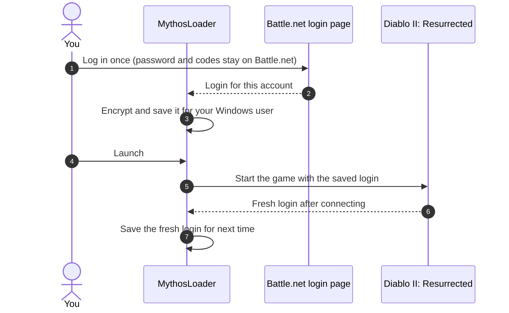

<p align="center">
  
</p>

<p align="center">
  <a href="https://discord.com/invite/d2rmythos"></a>
  
  
  
</p>

<p align="center">
  <b>
    <a href="#-features">Features</a> ·
    <a href="#-how-it-works">How it works</a> ·
    <a href="#-security-and-privacy">Security</a> ·
    <a href="#-getting-started">Getting started</a> ·
    <a href="#-faq">FAQ</a> ·
    <a href="https://discord.com/invite/d2rmythos">Discord</a>
  </b>
</p>

---

> [!IMPORTANT]
> **MythosLoader is in active development and has not been released yet.** Everything on this page
> describes version 1.0 as it is being built. Join the [D2R Mythos Discord](https://discord.com/invite/d2rmythos)
> to get the announcement the moment the first build is out.

**MythosLoader** lets you play several Diablo II: Resurrected accounts on one PC at the same time.
Add each Battle.net account once, then launch one, a few, or all of them with a single click. Every
game window gets its own name, so you always know which client is your Sorceress and which is your
Barbarian, and a press of a button tells you exactly where each one is on your screens.

No more logging in by hand. No more alt-tabbing through four identical windows called
"Diablo II: Resurrected". No command windows flashing, no extra tools to download.

<p align="center">
  
  <br>
  <sub><i>Concept preview of the main window. The final look may change before release.</i></sub>
</p>

## 📜 Contents

- [Why MythosLoader](#-why-mythosloader)
- [Features](#-features)
  - [Accounts and saved logins](#accounts-and-saved-logins)
  - [Run several clients side by side](#run-several-clients-side-by-side)
  - [Window titles](#window-titles)
  - [Find and Identify](#find-and-identify)
  - [Focus hotkeys](#focus-hotkeys)
  - [Intro skip](#intro-skip)
  - [System tray](#system-tray)
  - [Game options](#game-options)
  - [Groups and launch order](#groups-and-launch-order)
  - [Shortcuts and command line](#shortcuts-and-command-line)
  - [Window layouts](#window-layouts)
  - [Portable mode](#portable-mode)
- [Coming from D2RML?](#-coming-from-d2rml)
- [How it works](#-how-it-works)
- [Security and privacy](#-security-and-privacy)
- [Requirements](#-requirements)
- [Getting started](#-getting-started)
- [Settings reference](#-settings-reference)
- [FAQ](#-faq)
- [Troubleshooting](#-troubleshooting)
- [Roadmap](#-roadmap)
- [Community and support](#-community-and-support)
- [Disclaimer](#-disclaimer)

## ⚔ Why MythosLoader

Diablo II: Resurrected is built to run one copy at a time, and every launch normally means going
through Battle.net. If you play with more than one account (a magic-find character, a Battle Orders
barbarian, a mule, a friend's rush) that gets old fast:

| The usual way | With MythosLoader |
|---|---|
| The game refuses to open a second copy | Open as many clients as your PC can handle |
| Log in through Battle.net for every account, every time | Log in once per account; after that it's one click |
| Four windows all called "Diablo II: Resurrected" | `D2R: sorc-main`, `D2R: barb-alt`, `D2R: pala-aura`… named your way |
| Hunting through the taskbar for the right client | **Find** brings it to the front, **Identify** labels every window on screen |
| Sitting through the intro videos on every client | Skipped automatically, per account if you like |
| Typing launch options into shortcuts | Checkboxes for common options, globally or per account |

## ✨ Features

| | |
|---|---|
| 🔑 **Saved logins** | Log in on Battle.net's own page once. MythosLoader never sees your password. |
| 🪟 **Multi-launch** | One account, a group, or everything, launched in order with live progress. |
| 🏷 **Window titles** | Name every game window with a template like `D2R: {name}` or `[{index}] {label}`. |
| 🎯 **Find** | Bring any client to the front, even when it's minimised or on another monitor. |
| 🔦 **Identify** | Flash a big gold label over every running client so you can see which is which. |
| ⌨ **Focus hotkeys** | `Ctrl+Alt+1` to `9` jump straight to a client. |
| ⏩ **Intro skip** | No more logo videos, globally or per account. |
| 🧭 **System tray** | Launch, focus and identify clients from the tray menu. |
| ⚙ **Game options** | Windowed, no sound, mods and more, for all accounts or per account. |
| 🗂 **Groups** | "MF team", "Rush", "Mules": launch a whole group in one go. |
| 🔗 **Shortcuts** | Desktop shortcuts and command-line launching for any account or group. |
| 🔒 **Encrypted storage** | Saved logins are encrypted for your Windows user account. |

### Accounts and saved logins

- **Add an account** by logging in on Battle.net's real login page, shown inside MythosLoader.
  Authenticator and e-mail codes work exactly like they do in your browser.
- Prefer your own browser? Log in there and paste the address from the address bar instead.
- MythosLoader keeps the login, **not your password**, and encrypts it for your Windows user.
- **Logins stay fresh by themselves.** Each time the game connects, it hands back a new login.
  MythosLoader saves that new one automatically, so the next launch just works.
- Every account shows its **region**, **how old its saved login is**, and the result of its last launch.
- If a login stops working (for example because you logged into that account through Battle.net
  in the meantime), the row says **Log in again** and one click fixes it.

### Run several clients side by side

Diablo II: Resurrected normally refuses to start a second copy. MythosLoader takes care of that by
itself on every launch. There's nothing extra to download and no command windows popping up.

- Launch **one account**, **the ones you ticked**, **a group**, or **all of them**.
- Accounts launch **one after another**, each waiting until the previous one has logged in, with a
  short adjustable gap between them.
- A progress strip shows what's happening (`Launching barb-alt (2 of 3) · waiting for login`) with
  **Cancel** and **Cancel all** buttons.
- Clicking launch on an account that's already running brings it to the front instead of starting a
  second client on the same account.
- Games started some other way are listed under **Other clients**, and you can tell MythosLoader
  which account they belong to.

### Window titles

Every game window can be renamed so it's easy to find in the taskbar, in Alt+Tab and on screen.

- One **global template** for all accounts, plus a **per-account override**.
- **Live rename:** change the template and every running window updates instantly.
- **Title keeper:** if the game resets its title, MythosLoader puts yours back.
- **Keep the game's title** per account, for overlays or tools that look for the original title.

| Placeholder | Becomes | Example |
|---|---|---|
| `{name}` | Account name | `sorc-main` |
| `{label}` | Your label for the account (falls back to the name) | `Blizzard Sorceress` |
| `{region}` | Region | `EU` |
| `{index}` | Slot number of the running client | `2` |
| `{group}` | Group it was launched with | `MF team` |
| `{hotkey}` | Its focus hotkey | `Ctrl+Alt+2` |
| `{pid}` | Windows process number | `14200` |

Ready-made presets:

```text
D2R: {name}                 →  D2R: sorc-main
[{index}] {label}           →  [1] Blizzard Sorceress
{label} · {region}          →  Blizzard Sorceress · EU
D2R {index} - {name} ({hotkey})  →  D2R 1 - sorc-main (Ctrl+Alt+1)
```

### Find and Identify

<p align="center">
  
  <br>
  <sub><i>Concept of Identify all: every client is labelled for a few seconds.</i></sub>
</p>

- **Find** (row button, double-click, tray menu or hotkey) restores the client if it's minimised,
  brings it to the front and flashes it.
- **Identify** draws a gold border with the slot number and account name over a client for three
  seconds. **Identify all** does it for every running client at once. Minimised clients are listed
  in a small notification instead.
- The label is drawn *over* the game window by MythosLoader itself; nothing is added to the game.

### Focus hotkeys

Off by default; turn them on in Settings.

| Hotkey | Action |
|---|---|
| `Ctrl+Alt+1` … `Ctrl+Alt+9` | Bring client 1 to 9 to the front |
| `Ctrl+Alt+0` | Identify all |
| `Ctrl+Alt+L` | Show MythosLoader |

- The modifier can be changed to `Ctrl+Shift` or `Win+Alt`.
- Each account can be pinned to a fixed slot, so `Ctrl+Alt+1` is always your main.
- Bare F-keys are never used: F1 to F8 are your skill keys in game.
- If another program already owns a hotkey, the slot is marked as taken.

### Intro skip

- On by default, with a per-account override (Inherit / On / Off).
- Skips the logo videos of **the client that is starting**, and only during its first seconds.
  Nothing is sent once the game has logged in.
- Alternative method: the game's own *skip logo video* option, or both together.

### System tray

| Setting | Default |
|---|---|
| Minimise to tray | On |
| Close to tray | Off |
| Start minimised | Off |
| Start with Windows | Off |
| Notifications (login finished, login failed, all launches done) | On |

```text
MythosLoader
├─ Launch ▸           sorc-main · barb-alt · pala-aura · Launch all · Groups ▸
├─ Running ▸          [1] sorc-main · [2] barb-alt        (click to bring to front)
├─ Identify all
├─ Cancel launches    (while launching)
├─ Show MythosLoader
├─ Discord community
├─ Settings
└─ Exit               (your games keep running)
```

Closing MythosLoader never closes your games.

### Game options

Set launch options for all accounts, then add to them or replace them per account.

| Option | What it does |
|---|---|
| Windowed | Starts the game in a window |
| No sound | Mutes the client (great for second accounts) |
| Skip logo video | The game's own intro skip |
| Mod `<name>` | Loads a mod, with an optional *use txt files* switch |
| Direct | For extracted game data |
| Reset offline maps | Fresh offline maps on every game |
| Free text | Anything else, with normal Windows quoting |

A live preview shows exactly what each account will launch with. Options that would put login details
on the command line are blocked.

### Groups and launch order

- Create named groups such as **MF team**, **Rush** or **Mules**; an account can be in several.
- Drag accounts to set the launch order.
- **Launch group** from the toolbar, the tray, a shortcut or the command line.

### Shortcuts and command line

```powershell
MythosLoader.exe --launch sorc-main barb-alt   # launch these accounts, in this order
MythosLoader.exe --group "MF team"             # launch a group
MythosLoader.exe --minimized                   # start in the tray
```

- Works whether MythosLoader is already open or not.
- **Create desktop shortcut** on any account makes a one-click icon for it.

### Window layouts

- Save each client's position and size; it returns to the same spot on the next launch.
- **Arrange** tiles all running clients on a monitor (2×1, 2×2, 3×2).
- Layouts remember which monitor they belong to and are skipped if it's unplugged.

### Portable mode

Put an empty file named `portable` next to `MythosLoader.exe` and all settings stay in a `data`
folder beside it, handy for a USB stick or a games drive. Saved logins are still tied to your Windows
user, so on another PC or user you simply log in again.

## 🔁 Coming from D2RML?

MythosLoader is a modern successor to Sunblood's **D2RML**, which pioneered one-click multi-launching
for D2R and stopped working after patch 2.5. Thanks to Sunblood for the original idea.

| | D2RML | MythosLoader |
|---|---|---|
| Works on current D2R | ❌ Stopped at patch 2.5 | ✅ Built for the current game |
| Extra tools | Needs `handle64.exe` | Nothing extra |
| Administrator rights | Always | Designed to run as a normal user |
| Saved logins | Plain files next to the program | Encrypted for your Windows user |
| Window titles | Fixed `D2R:name` | Templates, live rename, title keeper |
| Find / Identify / hotkeys | ❌ | ✅ |
| Intro skip | Sent to whichever game window it finds first | Sent only to the client that is starting, per account |
| Tray menu | Empty | Launch, focus, identify, settings |
| Game options | One global text box | Global + per account, with checkboxes |
| Groups | ❌ | ✅ |
| Timeouts and Cancel | ❌ Can wait forever | ✅ Every step has a timeout and a Cancel button |

**Import from D2RML** (Settings → Data) brings over your accounts and settings in one step. Your old
files are left untouched.

## 🧠 How it works



1. **Log in once.** You log in on Battle.net's own page. MythosLoader only receives the result of
   that login, never your password.
2. **Saved, encrypted.** The login is stored encrypted for your Windows user account.
3. **Launch.** MythosLoader hands the saved login to the game, lets it open alongside your other
   clients, names its window and skips the intro.
4. **Stay fresh.** When the game connects, it gives back a new login. MythosLoader saves that one, so
   you never have to log in again as long as you launch through MythosLoader.

> [!TIP]
> Logging into an account through the normal Battle.net app uses up the login MythosLoader saved for
> it. That's fine: the account will show **Log in again**, and one click puts it right.

## 🔒 Security and privacy

**What MythosLoader stores** (in `%LocalAppData%\MythosLoader`, or next to the program in portable mode):

| File | Contents | Encrypted |
|---|---|---|
| `settings.json` | Your preferences | No secrets in it |
| `accounts.json` | Account names, labels, groups, per-account options, saved logins | Saved logins: **yes**, with Windows DPAPI |
| `logs\` | Activity log, last 7 days | Login data is removed automatically |

**What it never does**

- Never asks for, sees or stores your Battle.net password.
- Never reads or changes the game's memory, never injects anything into the game, never automates
  gameplay.
- Never sends one keystroke or click to several clients. Blizzard bans input broadcasting, and
  MythosLoader has no such feature.
- Never sends your data anywhere. The only network traffic is Battle.net's own login page and a
  once-a-day check of this repository for new releases (you can turn it off).

**An honest note on encryption.** Your saved logins are encrypted for your Windows user, which
protects them from other Windows users on the PC and from anyone who copies the files. Like any
program, it can't protect them from other software running under *your own* Windows account, so keep
your PC clean.

**What it touches on your PC**

| Area | What and why |
|---|---|
| Game process | Closes the game's "already running" check so another copy can start. Asks Windows only for the rights needed for that. |
| Game windows | Reads their position, sets their title, brings them to the front, sends a key during the intro when intro skip is on. |
| Registry | Writes the game's login slot right before a launch. Optional: the *Start with Windows* entry. |
| Files | Its own data folder, plus your D2R settings file only if you turn on per-account settings profiles. |
| Network | Battle.net login page; release check against this repository. |

## 💻 Requirements

- Windows 10 (version 1809 or newer) or Windows 11, 64-bit
- Diablo II: Resurrected installed through Battle.net
- Microsoft Edge WebView2 (already part of Windows 11 and up-to-date Windows 10) for the built-in login page
- A Battle.net account per client you want to run, each owning the game
- Enough PC for several clients: every client is a full copy of the game

## 🚀 Getting started

> [!NOTE]
> These steps apply once the first release is out. Until then, follow the
> [Discord](https://discord.com/invite/d2rmythos) for news.

1. **Download** `MythosLoader-x.y.z-win-x64.zip` from the [Releases](../../releases) page.
2. **Unzip** it anywhere you like. There's no installer.
3. **Run** `MythosLoader.exe`. The first-run wizard finds your game folder automatically.
4. **Add your accounts.** Click **＋ Add account**, pick your region, log in on the Battle.net page.
5. **Launch.** Tick your accounts and press **Launch selected**, or just **Launch all**.

**Verify your download** (optional): every release lists SHA-256 checksums in `SHA256SUMS.txt`.

```powershell
Get-FileHash .\MythosLoader-x.y.z-win-x64.zip -Algorithm SHA256
```

**"Windows protected your PC"?** New releases of any program can trigger SmartScreen until enough
people have downloaded them. Releases are code-signed; click **More info** to see the publisher, then
**Run anyway**.

## 🛠 Settings reference

| Section | Setting | Default |
|---|---|---|
| Game | Game folder | Detected automatically |
| Game | Launch options for all accounts | None |
| Windows | Rename game windows | On |
| Windows | Title template | `D2R: {name}` |
| Windows | Title keeper | On |
| Windows | Focus hotkeys | Off (`Ctrl+Alt`) |
| Intro skip | Skip intro videos | On |
| Intro skip | Method | Keypress (or game option, or both) |
| Launching | Gap between launches | 3 seconds |
| Launching | Give up waiting for login after | 90 seconds |
| Launching | Restore the game's login slot afterwards | On |
| Tray & startup | Minimise / close to tray, start minimised, start with Windows | On / Off / Off / Off |
| Tray & startup | Notifications | On |
| Updates | Check for new releases | On (once a day) |
| Advanced | Connection indicator per client | On |

Per account: label, title template or *keep the game's title*, hotkey slot, intro skip, launch
options (add or replace), saved window position, groups.

## ❓ FAQ

<details>
<summary><b>Is this allowed by Blizzard?</b></summary>

Blizzard allows playing several accounts at the same time. What it bans is input broadcasting:
software or hardware that sends one keystroke or click to several game clients. MythosLoader has no
such feature and never will. It is still a third-party tool, so use it at your own risk.
</details>

<details>
<summary><b>Does MythosLoader see my password?</b></summary>

No. You log in on Battle.net's real login page. MythosLoader only receives the login result that
page produces, the same thing the Battle.net app receives.
</details>

<details>
<summary><b>How many clients can I run?</b></summary>

As many as your PC can handle and you have accounts for. Each client is a full copy of the game, so
memory and graphics power are the limit. Windowed mode and *No sound* help on second clients.
</details>

<details>
<summary><b>Why does an account say "Log in again"?</b></summary>

Its saved login was used up, usually because the account was played through the normal Battle.net
app in the meantime, or because it wasn't launched for a long time. Click **Log in again** and it's
fixed.
</details>

<details>
<summary><b>Can I still use the Battle.net app?</b></summary>

Yes. Just remember that logging into an account there uses up the login MythosLoader saved for it.
MythosLoader warns you when Battle.net is running during a launch.
</details>

<details>
<summary><b>My map tool or overlay can't find the game since the windows were renamed.</b></summary>

Turn on **Keep the game's title** for that account (account settings → Window). Some tools look for
the original "Diablo II: Resurrected" title.
</details>

<details>
<summary><b>Can I move MythosLoader to another PC?</b></summary>

Your settings, groups and options move fine (portable mode makes it easy). Saved logins are encrypted
for your Windows user on that PC, so on a new PC you log each account in once more.
</details>

<details>
<summary><b>Is it open source?</b></summary>

No. MythosLoader is free to use, but its source code is private. This repository holds the releases,
documentation and issue tracker.
</details>

<details>
<summary><b>My antivirus complains.</b></summary>

Multi-launchers have to close the game's "already running" check inside the game process, which some
antivirus products find suspicious. Releases are code-signed and checksummed; you can confirm the
publisher in the file's properties. If your antivirus flags a release, tell us on Discord so we can
report the false positive.
</details>

## 🩹 Troubleshooting

| Problem | What to try |
|---|---|
| "Game not found" | Settings → Game → pick the folder that contains `D2R.exe` |
| Login timed out | The saved login was used up: **Log in again** on that account |
| The game closed before logging in | Launch again; if it repeats, check the game runs normally through Battle.net |
| Second client won't start | Make sure every running client was started normally; restart MythosLoader and try again |
| Window title not applied | Some tools change titles too; check *Title keeper*, or use *Keep the game's title* for that account |
| Hotkey marked "taken" | Another program owns it: pick a different modifier in Settings |
| Built-in login page is blank | Install Microsoft Edge WebView2, or use *paste from browser* |

Still stuck? Ask on [Discord](https://discord.com/invite/d2rmythos) and include the output of
**Copy details** from the app. It removes login data automatically.

## 🗺 Roadmap

- [x] Design and planning
- [ ] Core launcher: saved logins, multi-launch, encrypted storage
- [ ] Quality of life: window titles, Find and Identify, hotkeys, intro skip, tray, game options, groups
- [ ] **1.0 release**: signed build, first-run wizard, D2RML import
- [ ] After 1.0: per-account game settings profiles, one-click updates, light theme, more languages

Want something on this list? Suggest it on [Discord](https://discord.com/invite/d2rmythos).

## 💬 Community and support

<p align="center">
  <a href="https://discord.com/invite/d2rmythos"></a>
</p>

- **Help, questions and ideas:** the [D2R Mythos Discord](https://discord.com/invite/d2rmythos) is the fastest way.
- **Bugs:** open an issue with the bug-report form (after the first release).
- **Security problems:** please report privately, see [SECURITY.md](SECURITY.md).
- **Release notes:** [CHANGELOG.md](CHANGELOG.md) and the [Releases](../../releases) page.

> [!CAUTION]
> Never share your Battle.net password, a login link from your browser's address bar, or files from
> MythosLoader's data folder. Nobody from D2R Mythos will ever ask for them.

## ⚖ Disclaimer

MythosLoader is a third-party tool and is not affiliated with, endorsed by or connected to Blizzard
Entertainment. Diablo and Battle.net are trademarks or registered trademarks of Blizzard
Entertainment, Inc. in the U.S. and other countries. All other trademarks belong to their owners.
Using third-party launchers is at your own risk.

MythosLoader is free to use; see [LICENSE.md](LICENSE.md).

---

<p align="center">
  <br>
  <sub>Made by <b>D2R Mythos</b> for the Diablo II community · <a href="https://discord.com/invite/d2rmythos">discord.com/invite/d2rmythos</a></sub>
</p>
